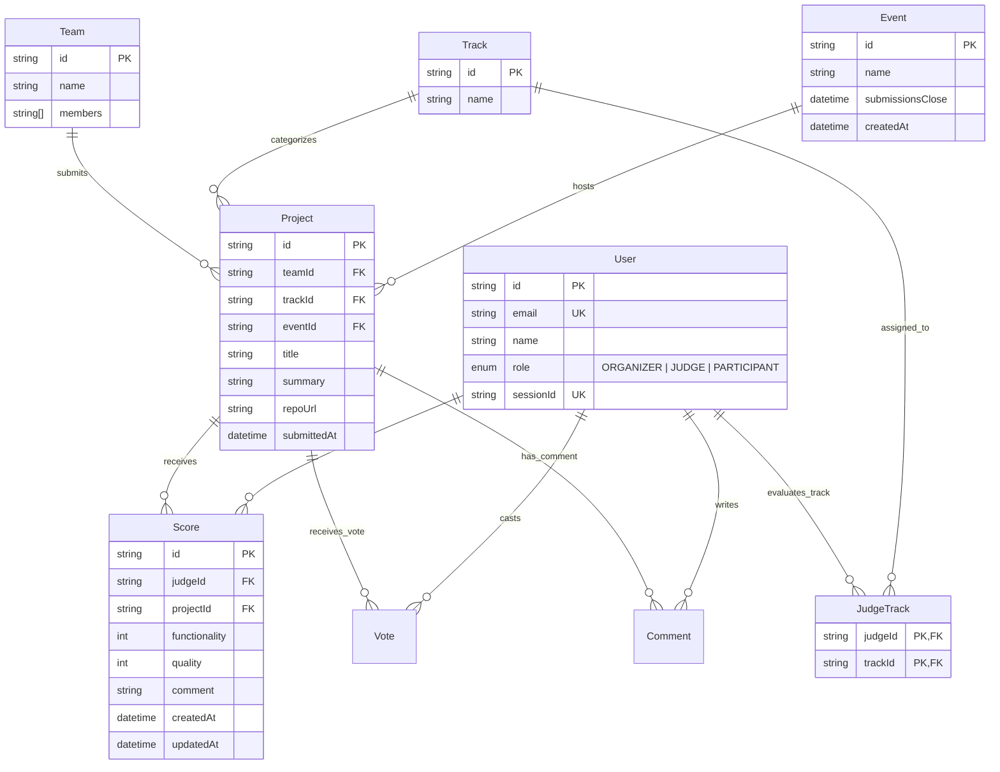

# DATA-MODEL.md — Schema & Data Pipeline

## 1. Entity-Relationship Overview



---

## 2. Table Specifications & Constraints

### `Event`
- `id` (String, PK): Unique event key (e.g. `evt_01`).
- `name` (String): Display name of the hackathon.
- `submissionsClose` (DateTime): UTC timestamp defining when project submissions permanently close.
- **Rule**: Compared against server clock to accept or reject new projects.

### `Track`
- `id` (String, PK): E.g. `trk_01` to `trk_08`.
- `name` (String): Track title (e.g. "Developer tools", "Accessibility").

### `User`
- `id` (String, PK): User identifier (e.g. `jdg_01`, `usr_organizer`).
- `email` (String, Unique): User email address.
- `role` (Enum): `ORGANIZER`, `JUDGE`, or `PARTICIPANT`.
- `sessionId` (String, Unique, Nullable): Session token matched against HTTP `Cookie: session=...` header.

### `JudgeTrack`
- Composite primary key `(judgeId, trackId)` representing many-to-many judging domain assignments.

### `Team`
- `id` (String, PK): Team identifier (e.g. `tm_01`).
- `name` (String): Team name.
- `members` (String Array): Member email list.

### `Project`
- `id` (String, PK): Project identifier (e.g. `prj_01`).
- `teamId` (String, FK -> `Team.id`): Submitting team.
- `trackId` (String, FK -> `Track.id`): Assigned category.
- `eventId` (String, FK -> `Event.id`): Parent event.
- `title` (String): Project name displayed in gallery.
- `summary` (String): High-level pitch.
- `repoUrl` (String): Source code repository link.
- `submittedAt` (DateTime): UTC timestamp when recorded.

### `Score`
- Composite uniqueness constraint: `@@unique([judgeId, projectId])` ensures a judge cannot submit duplicate ballots for the same project.
- `functionality` (Int, 1-5): Implementation fidelity.
- `quality` (Int, 1-5): Code craftsmanship and architectural soundness.
- `comment` (String): Contextual critique and rationale.

---

## 3. Data Ingestion (Fixtures Transformation)

The seed engine (`src/scripts/seed.ts`) parses `fixtures.json` and executes transactional ingestion:
1. **Truncation**: Cascading purge of all existing tables guarantees clean state.
2. **Event Seeding**: Seeds `submissions_close` verbatim from `fixtures.json` (`2026-03-01T18:00:00Z`).
3. **Identity Synthesis**:
   - `organizer@dogfood.local` generated with `ROLE = ORGANIZER`.
   - `participant@dogfood.local` generated with `ROLE = PARTICIPANT`.
   - `fixtures.judges[0]` (`jdg_01`, Tomas Varga) assigned as `Judge A`.
   - `fixtures.judges[1]` (`jdg_02`, Wei Lindqvist) assigned as `Judge B`.
4. **Resilience & Missing Values**: Handled gracefully using fallback defaults for missing criteria or optional review comments.

---

## 4. Data Egress & Export Specifications

### JSON Output (`/api/judge/scores`)
```json
{
  "judgeId": "jdg_01",
  "judgeName": "Tomas Varga",
  "totalScored": 3,
  "scores": [
    {
      "scoreId": "...",
      "project": { "id": "prj_01", "title": "Glass Signal", "track": { "name": "Security" } },
      "criteria": { "functionality": 4, "quality": 3 },
      "comment": "Solid architecture.",
      "scoredAt": "2026-02-28T12:00:00.000Z"
    }
  ]
}
```

### CSV Output (`/api/export.csv`)
- **MIME Type**: `text/csv; charset=utf-8`
- **Content-Disposition**: `attachment; filename="dogfood2026-scores.csv"`
- **Header Line**:
  ```csv
  project_id,project_title,track,team,judge_id,judge_name,judge_email,functionality,quality,average,comment
  ```
- **Quoting**: All textual fields containing potential delimiters or commas are wrapped in RFC 4180 quotes.
